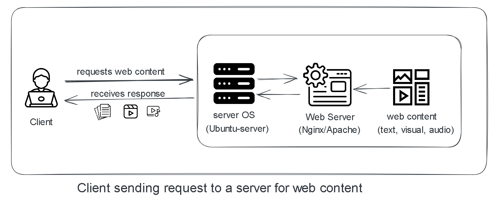
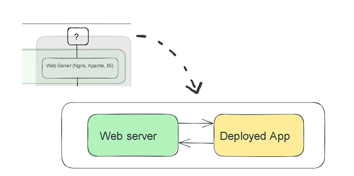
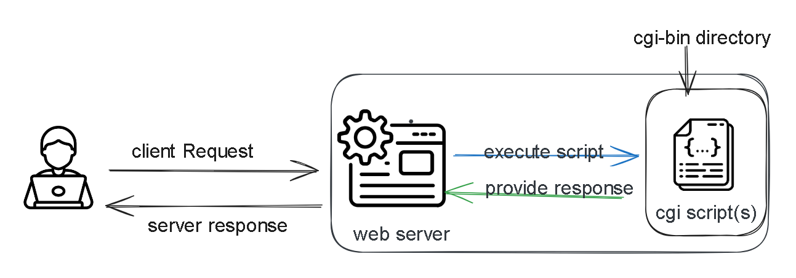

# Web-server Evolution

A web server is a computer program that lives on the server side and provides web content to clients. The web content can be textual (html page, text document), visual (mp4,GIF) or audio (mp3,flak).  
   
Examples of web servers include Apache, Nginx, IIS-(Internet Information Service)   
If you can recall from our previous lesson, on the block diagram that illustrated the relationship between the server side and the client side there was a question mark which we mentioned would be filled by the deployed application you will be building.     
In this lesson we will explore the details between the web Server and the deployed application.     
  
### Serving static files 
In the nascent years of the web, web servers could only server static files to a client. The client would make a request to the server and the server would respond with the files the client requested.    
This files lived on the servers file system and were served by the web server.  

As the web further evolved there was a need to perform some tasks on the server side and give a customized response based on the request received. This meant that the server was required to generate dynamic content based on the request received. 
This led to the development of CGI (Common Gateway Interface)
### CGI 
CGI is a standard protocol that defines how web servers can interact with external applications/scripts to process HTTP requests and generate dynamic content.  
CGI was implemented through creation of a CGi script that could be written in any programming language C and Perl were the common ones at this time. The CGI script lived in the cgi-bin directory where it was executed upon prompting by the web server. 
 
The Web server would receive a request from the client and pass it to the cgi script for execution, the cgi script would execute and provide a response and pass it to the web server which would then pass it to client.   

CGI was a good first hack at generating dynamic content for clients on the web, but had a few drawbacks in it's architecture.   
CGI was designed in such a way that for each request it would create a new process, process the request, give a response and then terminate th process. This was not very resource efficient as with multiple request many resources were created and terminated.   
The time taken to process each request had a significant delay due to the creation of new process each time a request was received.     
  

[What is web content](https://en.wikipedia.org/wiki/Web_content)    
[CGI Versus FastCGI versus WSGI](https://www.sobyte.net/post/2021-11/cgi-fastcgi-wsgi/)     
[PEP-3333 - WSGI official docs](https://peps.python.org/pep-3333/#specification-details)    
[How CGI Works](https://computer.howstuffworks.com/cgi.htm)     
[Youtube (PowerCert Animated Videos)- What is A server](https://www.youtube.com/watch?v=UjCDWCeHCzY)    
[What is WSGI -wsgi.readthedocs.io](https://wsgi.readthedocs.io/en/latest/what.html)    
[WSGI - introduction](https://wsgi.tutorial.codepoint.net/intro)    

Icons and resources

<a href="https://www.flaticon.com/free-icons/server" title="server icons">Server icons created by Freepik - Flaticon</a>    
<a href="https://www.flaticon.com/free-icons/custom" title="custom icons">Custom icons created by Vectors Tank - Flaticon</a>   
<a href="https://www.flaticon.com/free-icons/content-management" title="content management icons">Content management icons created by Freepik - Flaticon</a>    
<a href="https://www.flaticon.com/free-icons/paper" title="paper icons">Paper icons created by Freepik - Flaticon</a>   
<a href="https://www.flaticon.com/free-icons/video" title="video icons">Video icons created by pictranoosa - Flaticon</a>   
<a href="https://www.flaticon.com/free-icons/video" title="video icons">Video icons created by Hilmy Abiyyu A. - Flaticon</a>   
<a href="https://www.flaticon.com/free-icons/code" title="code icons">Code icons created by Smashicons - Flaticon</a>   
