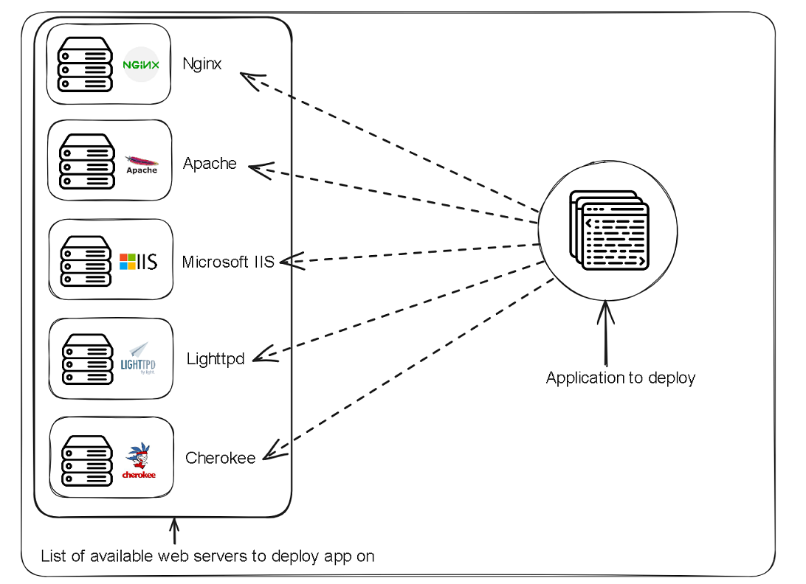

# Web-server Evolution

A web server is a computer program that lives on the server side and provides web content to clients. The web content can be textual (html page, text document), visual (mp4,GIF) or audio (mp3,flak).  
   
Examples of web servers include Apache, Nginx, IIS-(Internet Information Service)   
If you can recall from our previous lesson, on the block diagram that illustrated the relationship between the server side and the client side there was a question mark which we mentioned would be filled by the deployed application you will be building.     
In this lesson we will explore the details between the web Server and the deployed application.     
  
### Serving static files 
In the nascent years of the web, web servers could only server static files to a client. The client would make a request to the server and the server would respond with the files the client requested.    
This files lived on the servers file system and were served by the web server.  

As the web further evolved there was a need to perform some tasks on the server side and give a customized response based on the request received. This meant that the server was required to generate dynamic content based on the request received. 
This led to the development of CGI (Common Gateway Interface)
### CGI 
CGI is a standard protocol that defines how web servers can interact with external applications/scripts to process HTTP requests and generate dynamic content.  
CGI was implemented through creation of a CGi script that could be written in any programming language C and Perl were the common ones at this time. The CGI script lived in the cgi-bin directory where it was executed upon prompting by the web server. 
 
The Web server would receive a request from the client and pass it to the cgi script for execution, the cgi script would execute and provide a response and pass it to the web server which would then pass it to client.   

CGI was a good first hack at generating dynamic content for clients on the web, but had a few drawbacks in it's architecture.   
CGI was designed in such a way that for each request it would create a new process, process the request, give a response and then terminate th process. This was not very resource efficient as with multiple request many resources were created and terminated.   
The time taken to process each request had a significant delay due to the creation of new process each time a request was received.    

### Fastcgi  
The performance drawbacks of CGI led to the development of fastcgi which was a more efficient approach at request processing.  
Unlike cgi that created a new process for each request. FastCGI uses a persistent process pool to handle incoming requests. This reduced the time taken to process a request as now instead of consuming some unit of time in process creation and termination with each incoming request, a process was always available to process the incoming  requests.    

### More on web servers
We mentioned in the introduction that a web server is a program that processes requests for web content from the client. It is important to note that there are different flavours of web server software from various vendors, examples include Apache, Nginx, IIS, Cherokee, Lighttpd. The different flavours imply differences in processing architecture and hence there will be significant differences in how one web server will pass requests to a web app and how another will.    
This can pose as a challenge especially in terms of compatibility between web servers and web apps/web frameworks. consider the illustration below. 
 
A particular web framework/app may be designed to work well with a specific web server and porting it to a different web server may turn out to be a daunting task to developers.   
As new programming languages and frameworks were innovated there was an increase in the number of programming languages used on the web and the burden of integration was left on the shoulders of web framework/app authors. You can imagine the chaos that resulted from this approach as the web apps/frameworks were opinionated on the choice of server to use with them.       
There are some programming language/ framework authors that foresaw this challenge early enough and agreed on implementing a neutral specification and or api's to overcome this technical compatibility challenge, a perfect example would be the Java Servelet api of 1996 that later changed it's name to Jakarta Servelet in 2019. 
... more info on Jakarta servelet needed.   

### Python and the web server   
In it's nascent years in web app development python left the job of coming up with a way to integrate your app/framework with the server to the framework/app author. This of course led to the development of technically incompatible frameworks from the context of the server. Your choice of framework had an underlying direct consequence in the available usable servers. In such complicated circumstances you can obviously tell that change was not a thing that developers would be eager to embrace as it required a lot of courage as was tantamount to punishment. If you desired to change to a server that was not compatible with your web framework it meant you had to discard the framework and adopt another or refactor the web framework to work with your new choice of server.    
Now, in the midst of this anarchy, a saviour was born.    
Drumrolls 🥁🥁🥁.   

### WSGI (Web Server Gateway Interface)   
The Web server Gateway Interface is a specification that describes how a server and an application written in python should communicate. It was released in 2003 under PEP-333 and was revised in 2010 to PEP-3333 when Python 3 was released.    
WSGI is not a framework, neither is it an api, it simply is a guideline for how the server and the app/framework should communicate.    
WSGI is dual sided, it has a a server side and the application/framework side.  
The server side takes care of receiving requests from the client and the framework/app side takes care of processing the requests received from the client.     
This approach alleviates the web "app/framework" from the burden of taking care of how to communicate with a web server and leaves it only with the work of receiving requests and returning responses as illustrated below.   
 
In essence WSGI is a calling convention.    
The "application/framework" side provides a callable object(function, method, class, or instance with a __call__ method) to the server side. The callable object is aware of how and what parameters it should receive from the server side and what response it should provide to the server side. The server side part of WSGI takes care of the other details between it and the web server lying behind it.     
WSGI is a spec and there are various implementations of it.  
Examples of software applications built to implement the WSGI spec are:
 - uWSGi
 - gunicorn
 - mod_wsgi 
 There is also a web app library called Werkzeug that provides utilities for building WSGI compliant apps.  
 The Illustration below depicts the Interaction among the three.
 The web server, the wsgi implementation, the deployed app.     

   

 ### ASGI
As has been mentioned earlier WSGI was introduced in PEP-333 in 2003 and revised to PEP-3333 in 2010 with the introduction of python 3. Python is a constantly evolving to adopt new features, after PEP-3333 more features were added to python including asynchronous programming. Asynchronous programming is a way of executing programs in which the order of execution does not matter in contrast to synchronous programming in which order matters.     
If there are 4 tasks to be performed. If it is done synchronously where order matters then execution will move from task 1, then task 2 and so on until task 4. On the contrast if execution is done asynchronously then execution can start with task 1, then pause with task 2 if there there is a factor preventing the task from completion and move on task 3 and 4 then go back to task 2. The Key takeaway is that with synchronous programming Order of execution matters while with asynchronous order does not matter.    
WSGI was designed to work with synchronous python apps. But as python evolved and introduced asynchronous programming applications started being written asynchronously which WSGI could not support. This led to the development of ASGI (Asynchronous  Server Gateway Interface) which took after WSGI by providing a common specification for how async capable python web apps could communicate with web servers.  
Examples of software applications built to implement the ASGI spec are:
- Uvicorn 
- Magnum
- Hypercorn 
- Daphne 

  

 

[What is web content](https://en.wikipedia.org/wiki/Web_content)    
[How CGI Works](https://computer.howstuffworks.com/cgi.htm)     
[CGI Versus FastCGI versus WSGI](https://www.sobyte.net/post/2021-11/cgi-fastcgi-wsgi/)     
[WSGI- Wikipedia](https://en.wikipedia.org/wiki/Web_Server_Gateway_Interface)      
[What is WSGI -wsgi.readthedocs.io](https://wsgi.readthedocs.io/en/latest/what.html)    
[WSGI - introduction](https://wsgi.tutorial.codepoint.net/intro)    
[PEP-3333 - WSGI official docs](https://peps.python.org/pep-3333/#specification-details)    
  

Icons and resources

<a href="https://www.flaticon.com/free-icons/server" title="server icons">Server icons created by Freepik - Flaticon</a>    
<a href="https://www.flaticon.com/free-icons/custom" title="custom icons">Custom icons created by Vectors Tank - Flaticon</a>   
<a href="https://www.flaticon.com/free-icons/content-management" title="content management icons">Content management icons created by Freepik - Flaticon</a>    
<a href="https://www.flaticon.com/free-icons/paper" title="paper icons">Paper icons created by Freepik - Flaticon</a>   
<a href="https://www.flaticon.com/free-icons/video" title="video icons">Video icons created by pictranoosa - Flaticon</a>   
<a href="https://www.flaticon.com/free-icons/video" title="video icons">Video icons created by Hilmy Abiyyu A. - Flaticon</a>   
<a href="https://www.flaticon.com/free-icons/code" title="code icons">Code icons created by Smashicons - Flaticon</a>   
<a href="https://www.flaticon.com/free-icons/nginx" title="nginx icons">Nginx icons created by Freepik - Flaticon</a>   
<a href="https://iconscout.com/icons/apache" class="text-underline font-size-sm" target="_blank">Apache</a> by <a href="https://iconscout.com/contributors/icon-mafia" class="text-underline font-size-sm" target="_blank">Icon Mafia</a>   
<a href="https://branditechture.agency/brand-logos/" title="Microsoft IIS Logo icon">Microsoft IIS Logo - Free brand Logos </a>     
<a href="https://branditechture.agency/brand-logos/" title="Lighttpd Logo icon"> Lighttpd Icon - Free brand Logos </a>  
<a href="https://branditechture.agency/brand-logos/" title="Cherokee Logo icon"> Cherokee Icon - Cherokee Facebook Account </a>   
<a href="https://www.flaticon.com/free-icons/source-code" title="source code icons">Source code icons created by Vectors Tank - Flaticon</a>    
<a href="https://seeklogo.com/vector-logo/393096/uwsgi" title=" uWSGI icon">uWSGI logo - Seek Logo</a>   
<a href="https://www.flaticon.com/free-icons/python-file" title="python file icons">Python file icons created by Smashicons - Flaticon</a>  

